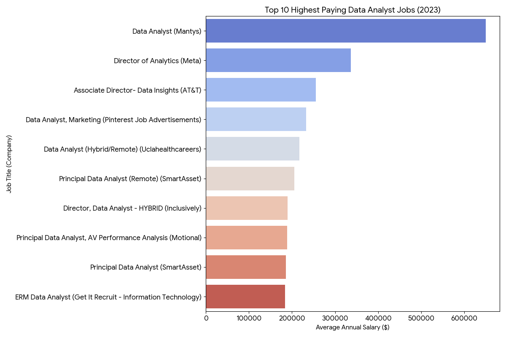
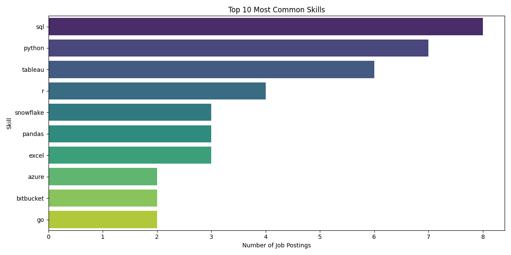

# Introduction
This project explores the Data Analyst job market, digging into the top paying roles and the skills they demand. By analyzing where high demand meets high pay, it highlights the tools, languages, and frameworks that give professionals the biggest career edge.

SQL queries? Check them out here: [project_sql](/project_sql/)

# Background
I undertook this project to refresh and strengthen my SQL skills while exploring the current Data Analyst job market. 
### My goal was to answer five key questions:

1. What are the top-paying Data Analyst jobs?
2. What skills are required for these top paying roles?
3. Which skills are most in demand for Data Analysts?
4. Which skills are associated with higher salaries?
5. What are the most optimal skills to learn?

By combining hands on SQL analysis with real job posting data, this project identifies the intersection of high demand and high pay, providing insights into the skills that matter most for career growth in the field.

# Tools I Used
For my deep dive into the Data Analyst job market and top paying skills, I used several tools to manage, query, and analyze the data:

- SQL: For writing queries and analyzing patterns in the job postings.

- PostgreSQL: As the database platform to store and work with the data.

- Git & GitHub: To track changes and manage the project workflow.

# The Analysis
Each query for this project aimed at investigating aspects of the data analyst job market. 
Here's how i approached each question:

### 1. **Question: What are the top-paying jobs for my role?**
- Identify the top 10 highest-paying data analyst roles that are available remotely.
- Focus on job postings with specified salaries (remove nulls)

```sql
SELECT  
    job_id,
    job_title,
    job_location,
    job_schedule_type,
    salary_year_avg,
    job_posted_date,
    name as company_name
FROM    
    job_postings_fact AS job_postings
LEFT JOIN company_dim AS company ON job_postings.company_id = company.company_id
WHERE   
    job_title_short = 'Data Analyst' AND 
    job_location = 'Anywhere' AND
    salary_year_avg IS NOT NULL
ORDER BY    
    salary_year_avg DESC
LIMIT 10

```

*Bar graph visualizing the salary for the top 10 salaries for data analysts; ChatGPT generated this graph from my SQL query results*

#### **Breakdown:**

- The salary ceiling is very high: While the average data analyst makes much less, the top 10 roles in 2023 all paid over $184,000, with one outlier reaching $650,000.

- Seniority is the biggest factor: Most of these high-paying "analyst" jobs are actually senior leadership positions, like Directors or Principal Analysts.

- Technical specialization pays off: Skills in big data tools like PySpark and Databricks, or "DataOps" tools like GitLab and Kubernetes, command significantly higher salaries than standard SQL or Excel alone.

- Remote work is the standard for top pay: Almost all the highest-paying roles are listed as "Anywhere" or Remote, meaning you don't necessarily need to live in a high-cost tech hub like San Francisco to get these salaries.

- Niche industries pay more: Roles focused on specific areas like Marketing Analytics or Autonomous Vehicles tend to have higher compensation than generalist roles.

### 2. **Question: what skills are required for the top paying data analyst jobs?**
- use first query to see 10 highest paying jobs for data analysts
- add the specific skills required for these roles

```sql
WITH top_paying_jobs AS(
    SELECT  
        job_id,
        job_title,
        job_location,
        salary_year_avg,
        job_posted_date,
        name as company_name
    FROM    
        job_postings_fact AS job_postings
    LEFT JOIN company_dim AS company ON job_postings.company_id = company.company_id

    WHERE   
        job_title_short = 'Data Analyst' AND 
        job_location = 'Anywhere' AND
        salary_year_avg IS NOT NULL
    ORDER BY    
        salary_year_avg DESC
    LIMIT 10
)

SELECT 
    top_paying_jobs.*,
    skills
FROM 
    top_paying_jobs
INNER JOIN skills_job_dim ON top_paying_jobs.job_id = skills_job_dim.job_id
INNER JOIN skills_dim ON skills_job_dim.skill_id = skills_dim.skill_id
ORDER BY
    salary_year_avg DESC
```

#### **Breakdown:**
- SQL is leading
- Python follows closely
- Tableau is third
- Other skills are R, snowflake, pandas and excel


*Bar graph visualizing the salary for the top 10 salaries for data analysts; ChatGPT generated this graph from my SQL query results*


### 3. **Question: what are the most in-demand skills for data analyst?**
- join job postings to inner join table similar to query 2
- identify the top 5 in-demand skills for a data analyst
- focus on all job postings so not just remote
- we need the count of skills 


```sql
SELECT 
    skills,
    COUNT(skills_job_dim.job_id) AS demand_count
FROM 
    job_postings_fact
INNER JOIN skills_job_dim ON job_postings_fact.job_id = skills_job_dim.job_id
INNER JOIN skills_dim ON skills_job_dim.skill_id = skills_dim.skill_id
WHERE
    job_title_short = 'Data Analyst' AND
    job_location LIKE 'Calgary%'
GROUP BY
    skills
ORDER BY
    demand_count DESC
LIMIT 5
```
**Results from running this query:**
| Skill   | Demand Count |
|---------|--------------|
| SQL     | 84           |
| Excel   | 59           |
| Python  | 53           |
| Power BI| 42           |
| Tableau | 37           |


### 4. **QUESTION: what are the top skills based on salarty?**
- look at the average salary associated with each skill for data analyst positions
- focus on roles with specified salaries, regardless of location
- we need the name of skills from skills_dim, and salary_year_avg from job_posted_fact

```sql
SELECT 
    skills,
    ROUND(AVG(salary_year_avg), 0) as avg_salary
FROM 
    job_postings_fact
INNER JOIN skills_job_dim ON job_postings_fact.job_id = skills_job_dim.job_id
INNER JOIN skills_dim ON skills_job_dim.skill_id = skills_dim.skill_id
WHERE
    job_title_short = 'Data Analyst' AND
    salary_year_avg IS NOT NULL AND
    job_work_from_home = TRUE
GROUP BY
    skills
ORDER BY
    avg_salary DESC
LIMIT 25
```
**Results from running this query:**
| Skill          | Average Salary |
|----------------|----------------|
| PySpark        | 208,172        |
| Bitbucket      | 189,155        |
| Couchbase      | 160,515        |
| Watson         | 160,515        |
| DataRobot      | 155,486        |
| GitLab         | 154,500        |
| Swift          | 153,750        |
| Jupyter        | 152,777        |
| Pandas         | 151,821        |
| Elasticsearch  | 145,000        |
| Golang         | 145,000        |
| NumPy          | 143,513        |
| Databricks     | 141,907        |
| Linux          | 136,508        |
| Kubernetes     | 132,500        |
| Atlassian      | 131,162        |
| Twilio         | 127,000        |
| Airflow        | 126,103        |
| Scikit-learn   | 125,781        |
| Jenkins        | 125,436        |
| Notion         | 125,000        |
| Scala          | 124,903        |
| PostgreSQL     | 123,879        |
| GCP            | 122,500        |
| MicroStrategy  | 121,619        |

#### **Breakdown:**
- Big Data & Cloud Skills Pay the Most – Tools like PySpark, Databricks, Airflow, and GCP dominate 
the top salaries, reflecting high demand for managing and orchestrating large-scale data pipelines.

- Specialized Programming & DevOps Are Valuable – Languages like Scala, Golang, Swift and 
platforms like Bitbucket, GitLab, Atlassian command higher salaries than standard Python libraries, 
showing that scalable coding and workflow skills are premium.

- AI/ML and Enterprise Platforms Boost Pay – Skills in Watson, DataRobot, and Scikit-learn 
highlight that machine learning, automation, and enterprise AI knowledge are highly 
compensated in data roles.


### 5. **Question: What are the most optimal skills to learn?**
- identify skills in high demand and associatted with high average salaries for data analyst roles
- concentrates on remote positions with specified salaries

```sql
WITH skills_demand AS (
    SELECT 
        skills_dim.skill_id,
        skills_dim.skills,
        COUNT(skills_job_dim.job_id) AS demand_count
    FROM job_postings_fact
    INNER JOIN skills_job_dim ON job_postings_fact.job_id = skills_job_dim.job_id
    INNER JOIN skills_dim ON skills_job_dim.skill_id = skills_dim.skill_id
    WHERE
        job_title_short = 'Data Analyst' AND
        salary_year_avg IS NOT NULL AND
        job_work_from_home = TRUE
    GROUP BY
        skills_dim.skill_id

), average_salary AS (
    SELECT 
        skills_job_dim.skill_id,
        ROUND(AVG(job_postings_fact.salary_year_avg), 0) as avg_salary
    FROM job_postings_fact
    INNER JOIN skills_job_dim ON job_postings_fact.job_id = skills_job_dim.job_id
    INNER JOIN skills_dim ON skills_job_dim.skill_id = skills_dim.skill_id
    WHERE
        job_title_short = 'Data Analyst' AND
        salary_year_avg IS NOT NULL AND
        job_work_from_home = TRUE
    GROUP BY
        skills_job_dim.skill_id
)

SELECT
    skills_demand.skill_id,
    skills_demand.skills,
    demand_count,
    avg_salary
FROM
    skills_demand
INNER JOIN average_salary ON skills_demand.skill_id = average_salary.skill_id
WHERE  
    demand_count > 10
ORDER BY    
    demand_count DESC,
    avg_salary DESC
LIMIT 25
```
**Results from running this query:**
| Skill        | Demand Count | Average Salary |
|--------------|--------------|----------------|
| SQL          | 398          | 97,237         |
| Excel        | 256          | 87,288         |
| Python       | 236          | 101,397        |
| Tableau      | 230          | 99,288         |
| R            | 148          | 100,499        |
| Power BI     | 110          | 97,431         |
| SAS          | 63           | 98,902         |
| PowerPoint   | 58           | 88,701         |
| Looker       | 49           | 103,795        |
| Word         | 48           | 82,576         |
| Snowflake    | 37           | 112,948        |
| Oracle       | 37           | 104,534        |
| SQL Server   | 35           | 97,786         |
| Azure        | 34           | 111,225        |
| AWS          | 32           | 108,317        |
| Sheets       | 32           | 86,088         |
| Flow         | 28           | 97,200         |
| Go           | 27           | 115,320        |
| SPSS         | 24           | 92,170         |
| VBA          | 24           | 88,783         |
| Hadoop       | 22           | 113,193        |
| Jira         | 20           | 104,918        |
| JavaScript   | 20           | 97,587         |
| SharePoint   | 18           | 81,634         |

#### **Skills, Demand, and Salary Summary:**

- Most in-demand skills: SQL (398), Excel (256), Python (236), Tableau (230), R (148)

- Highest paying skills (among this list): Go (115,320), Hadoop (113,193), Snowflake (112,948), Azure (111,225), AWS (108,317)

- Balanced high-demand + high-salary skills: Python, Tableau, SQL, Power BI, Oracle, Looker

- Other insights: Common office tools like Excel, PowerPoint, Word, and Sheets remain highly demanded, though salaries are moderate compared to specialized tech skills.

# What I Learned
After not using SQL since university, this recent hands-on practice really helped me brush up and solidify my memory from my computer science specialization. Going through the exercises reminded me of some core concepts I hadn’t used in years and gave me a chance to apply them in a practical setting.

Some highlights from the refresher:

- I clarified the differences between GROUP BY and ORDER BY, and learned when it’s appropriate to use the HAVING clause for filtering aggregated results.

- Practicing SQL syntax in real queries reinforced my understanding of table and column aliases, and how to handle potential ambiguities when multiple tables share column names.

- I got comfortable again with joins, INNER, LEFT, RIGHT, and FULL OUTER, and how to combine tables effectively depending on the data I need.

- Loading CSV files through VS Code reminded me of practical considerations, like setting up a connection with PostgreSQL, understanding how the database accesses files, and handling file paths and permissions, real world details that aren’t always covered in theory.

- Overall, it was satisfying to see how much of my previous knowledge was still there, and refreshing it gave me confidence to tackle SQL tasks more efficiently and with clarity.

# Conclusions
From the analysis, several general insights emerged: 
1. **Top-paying Data Analyst jobs**: The highest paying jobs for data analysts that allow remote work offer a wide range of salaries, the highest at $650,000!

2. **Skills required for top-paying roles**: High paying Data Analysts roles required advanced proficiency in SQL.

3. **Most in-demand skills for Data Analysts**: SQL is also the most demanded skill in the data analyst job market, making it essential for job seekers.

4. **Skills associated with higher salaries**: Specialized skills, such as SVN and Solidity, are associated with the highest average salaries.

5. **Most optimal skills to learn**: SQL leads in demand and offers for a high average salary, making it one of the most optimal skills for data analysts.

### Closing Thoughts
This refresher not only enhanced my SQL skills but also gave me a better understanding of how technical skills are applied in the job market. It highlighted which skills are in demand, how expectations vary across different companies and regions, and how even remote roles can require nuanced knowledge of databases and data workflows. Overall, it reinforced the importance of continuously practicing and updating technical skills to stay competitive and adaptable in a rapidly evolving tech landscape.